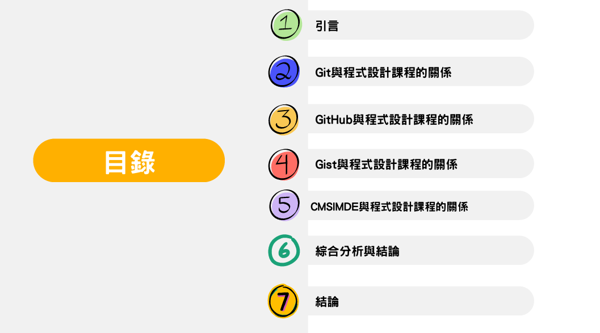
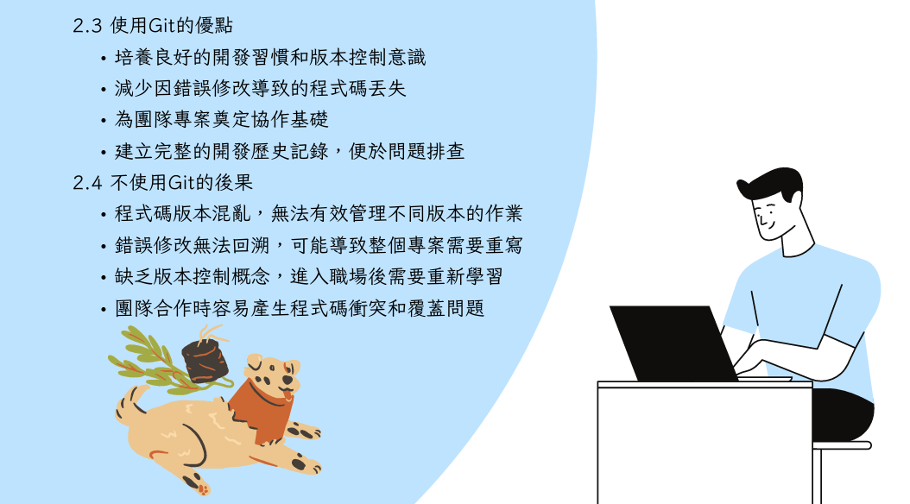
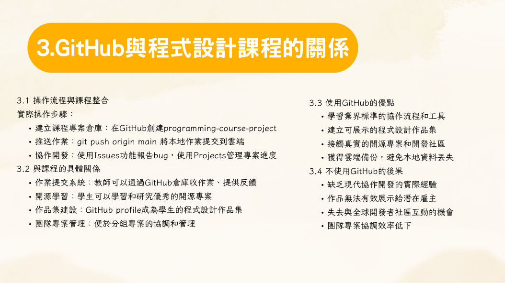
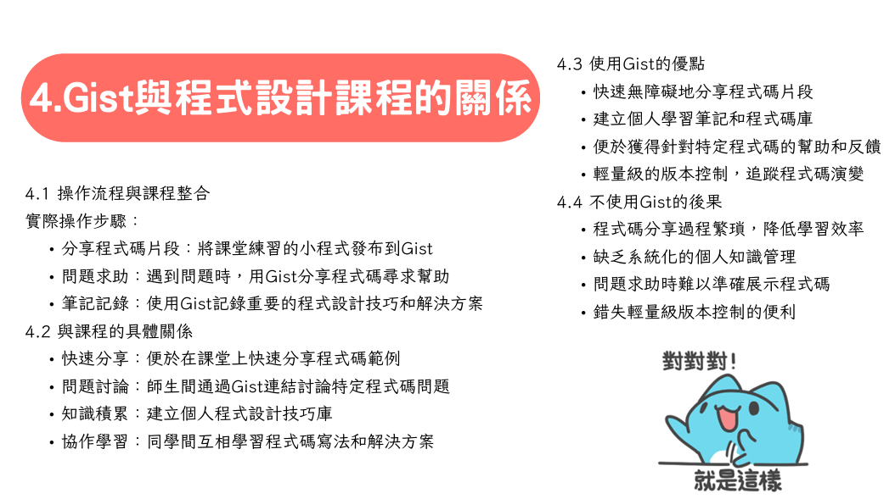
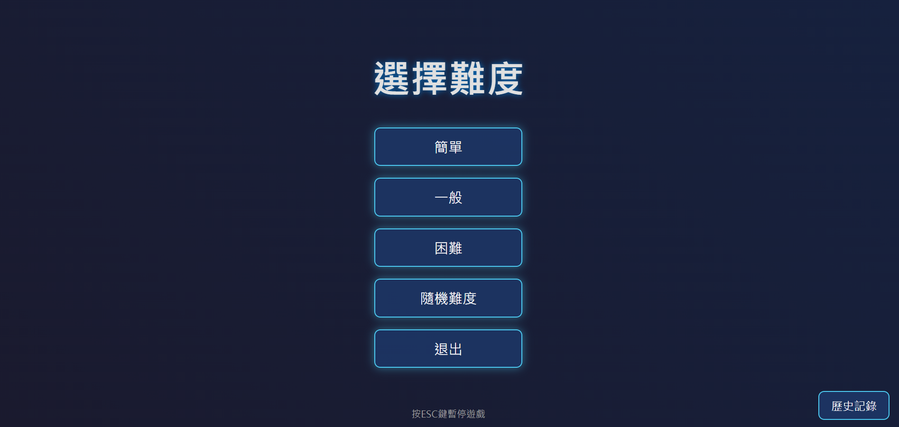
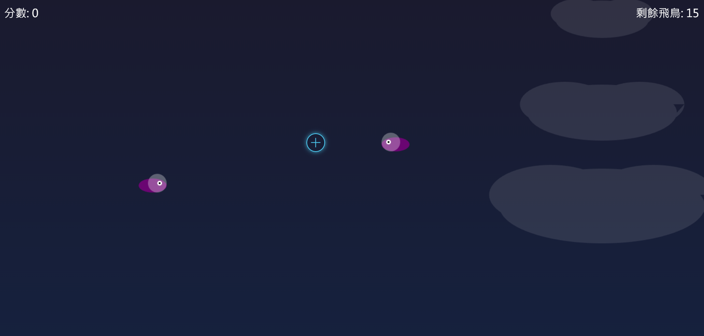
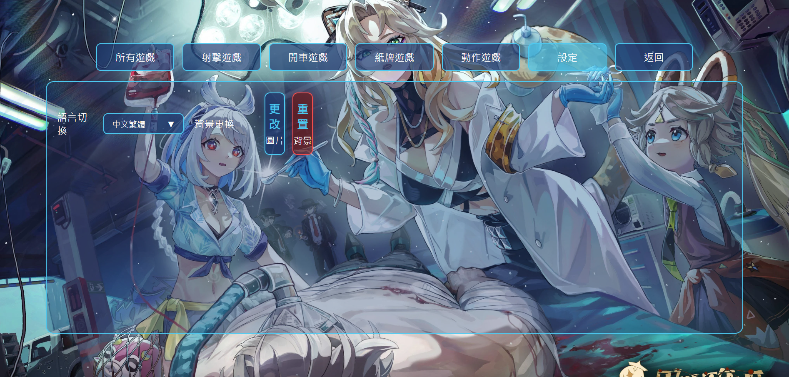
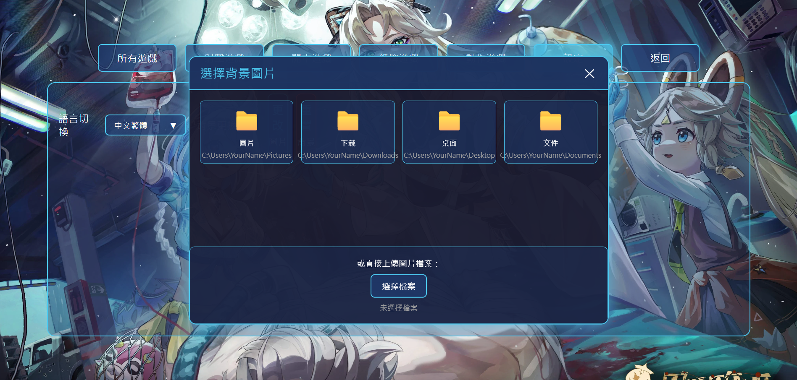
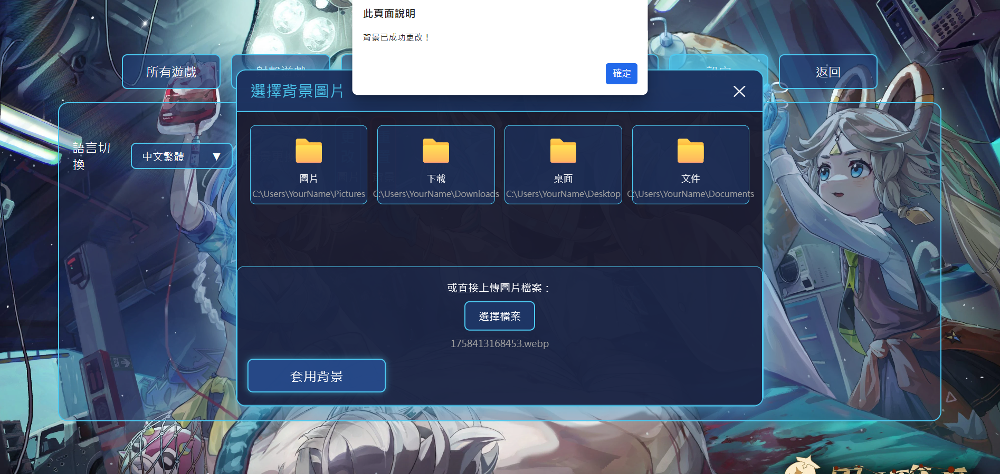

# ## [此處是1a-ag7分組靜態網網站](https://mdecp2025.github.io/1a-ag7/content/index.html)
### Robotics Reflections ⬆

# w4 Computer Programming Project Report

**Team Members**：陳漢宸、周昱翰、李承祐  
**Date**：2025 年 10 月 1 日

## Theme
什麼是 git, GitHub, gist 與 CMSIMDE? 如何使用這些工具？為什麼要使用這些工具？

## Table of Contents

1. [引言](#引言)
2. [Git與程式設計課程的關係](#git與程式設計課程的關係)
3. [GitHub與程式設計課程的關係](#github與程式設計課程的關係)
4. [Gist與程式設計課程的關係](#gist與程式設計課程的關係)
5. [CMSIMDE與程式設計課程的關係](#cmsimde與程式設計課程的關係)
6. [綜合分析與結論](#綜合分析與結論)

## Project Report Content

### Page 1


### Page 2  


### Page 3


### Page 4


### Page 5


### Page 6 


### Page 7


### Page 8


### Page 9


### Page 10


### Page 11


# --------------------------------------------------------------------------------------------------------------------------------
# 


# 41423117_Individually Created

## Click [here to open the simulator](https://41423117.github.io/Eternal-Realm-Games/)
## Click [Click here to record when opening a YouTube video](https://youtu.be/_Cj6NyARDBo)
## Click [Code Example](index.html)   
## Click [This is an individually created website](https://github.com/41423117/Eternal-Realm-Games)
## Click [This is a personal notes/reflections section](https://view.officeapps.live.com/op/view.aspx?src=https%3A%2F%2Fraw.githubusercontent.com%2F41423117%2Fword%2Frefs%2Fheads%2Fmain%2F%255B%25E5%25B0%2588%25E6%25A1%2588%255D%25E5%25BE%259E%25E9%259B%25B6%25E9%2596%258B%25E5%25A7%258B%25E5%25AD%25B8%25E7%25BF%2592%25E7%25A8%258B%25E5%25BC%258F%25E9%2596%258B%25E7%2599%25BC.docx&wdOrigin=BROWSELINK)

### Page 1


### Page 2


### Page 3


### Page 4  


### Page 5


### Page 6  


### Page 7


### Page 8


### Page 9


### Page 10 


### Page 11  


# w9_11/6_12:41 Successfully launched
I have created a game at this stage. The background of the game's main start screen is as shown in the 2k image, and a text button that says "Start" is generated in the lower middle section of the horizontal screen.

When the spacebar is pressed or the mouse clicks the start button, the scene gradually transitions to another screen. The background of this screen is generated as per image 1753283162418.

In the middle of this screen, five flat rectangular slots are generated from top to bottom. The text in the first slot from the top is "Simple," the text in the second slot is "Normal," the text in the fourth slot is "Random Difficulty," and the text in the fifth slot is "Exit."

When the first slot is pressed, the game starts. Birds are generated one by one on either the far left or far right side of the top half of the screen. The generation time is random, between 1 to 2.5 seconds, and all birds fly toward the opposite side. When a bird touches its respective opposite side, it disappears. This level only generates 15 birds, and the speed of the birds at the start of the game is not too fast.

When the second slot is pressed, the game starts. The number of birds generated and their movement speed are increased by 5 birds and 0.3 seconds faster, respectively, compared to the first slot.

When the third slot is pressed, the game starts. The number of birds generated and their movement speed are increased by 10 birds and 0.5 seconds faster, respectively, compared to the second slot.

When the fourth slot is pressed, the game starts. The number of birds generated and their movement speed vary randomly between the values of the first, second, and third slots.

In these four levels of the game, my mouse cursor becomes a shooting circle. When the circle clicks on a bird, the bird is killed and disappears. The clickable range of my circle is 1.5 times its size. The level ends when all birds have completely disappeared.

When the ESC key on the keyboard is pressed, the game pauses, and the screen with the five slots appears. Additionally, a new slot is generated below the fifth slot, with the text "Continue" inside it.

When the "Continue" slot is pressed, the game returns to the paused screen and resumes the unfinished level until the game ends. If the "Exit" slot is pressed, the scene transitions back to the main start screen of the game.

To enter the game again, simply press the "Start" button once more.

When a level is completed, the five slots reappear. If "Exit" is pressed at this point, the scene transitions back to the main start screen of the game. To enter the game again, simply press the "Start" button once more.

  
# w10_11/13_00:19 New feature added: After completing each level, the game now returns to the difficulty selection screen. Additionally, I have improved the issue where the remaining bird count did not update when birds flew to the end.

## Key Update Notes


### Added an escaped bird counter:

Added a birdsEscaped variable to track the number of birds that have flown off the screen.

Improved the bird disappearance logic.

In the updateBirds() function, a check is now performed to determine whether a bird has completely flown off the screen.
  
### When a bird flies out from the left side, check bird.x.
```
bird.x > gameCanvas.width + birdWidth/2。
```
### When a bird flies out from the right side, check bird.x.
```
bird.x < -birdWidth/2。
```

Birds that fly off the screen will be removed from the array, and the birdsEscaped count will be incremented.

### The method for calculating remaining birds has been updated:

The [updateBirdsLeft()] function has been modified. The calculation is now as follows:

Remaining birds = Total birds - Birds killed - Birds escaped.

This accurately reflects the number of birds that still need to be dealt with.

### Improved Bird Generation Logic:

When generating birds, the direction of each bird (fromLeft) is recorded.

Records include: date and time, difficulty level, and score.

The most recent records are displayed at the top, with older records listed below in descending order.

### Data Persistence:

Uses localStorage to save historical records.

Records persist even after closing the browser or refreshing the page.

A maximum of 50 recent records are saved.


### History Display:

Each record shows the date, difficulty level, and score.

If no historical records exist, "No game records yet" is displayed.


# 11/15_02:53 I changed the game title to 【Eternal Realm Kingdom】 and added multiple game options and language settings:


## New Features

### Game Selection Interface:

After clicking "Start Game," a new game selection interface is displayed.

There are six category tabs at the top: All Games, Shooting Games, Driving Games, Card Games, Action Games, Settings.

The "All Games" category is displayed by default.

The content area displays games corresponding to the selected category.

### Game Display:

"Bird Shooting Game" is displayed in both the "All Games" and "Shooting Games" categories.

Clicking "Bird Shooting Game" leads to the difficulty selection interface.

Other categories display "No games available" if they are empty.

### Language Switching Function:

Language switching options are displayed in the "Settings" category.

The language selector defaults to displaying "中文繁體" (Traditional Chinese).

Clicking it expands a list containing multiple language options.

After selecting a language, all text on the page switches to the corresponding language.

The language names within the selector itself always remain in Chinese.

### Multi-language Support:

Complete translations for Traditional Chinese, Simplified Chinese, and English have been implemented.

Other languages can be easily added.

This implementation retains all the original features of the Bird Shooting Game while adding the game selection interface and language switching function. The interface design maintains the original style, ensuring a consistent user experience.

# w13 12/06_04:00 更Feature Update

## New Features:


### Background Change Function:

Added a "Change Background" option below the language switch in the Settings page.

A "Change Picture" button is on the right; clicking it opens a simulated file explorer window.

### File Explorer Simulation:

Designed an interface similar to the Windows File Explorer.

Displays common folders (Pictures, Downloads, Desktop, Documents).

Provides a direct image upload function.

### Image Processing and Saving:

Uses the FileReader API to read image files.

Saves images in Base64 format to localStorage.

Applies the background image using the CSS variable (--custom-background).

### Persistent Storage:

Uses localStorage to save the background image.

The background image persists after the game is closed or the page is refreshed.

Image clarity is maintained.

### Background Application Scope:

Applied to the "Start Game" main screen.

Applied to the "Options screen after starting the game."

Retains the original tech-style light points and robotic arm effects.

### Reset Function:

Added a "Reset Background" button.

Restores the default background style.

### Multi-language Support:

The background change function supports multi-language display.

Integrated with the existing language system.

This allows users to freely change the game's background image, and the changed background will be permanently saved until the user manually resets it.

# w14_12/14_15:20  Modifications:

## 1. CSS Section (Lines 135-275): Completely replaced the robotic arm style with an armor-plated style, including:

Deeper metallic tones and pronounced borders.

5 distinct, protruding fingers (thumb, index finger, middle finger, ring finger, little finger).

Finger joint details and a longer design.

Armor plates and bolt/rivet decorations.

Enhanced light effects and shadows.

## 2. HTML Section (Lines 519-547): Replaced the structure of the left and right robotic hands:

Added more finger structures (5 fingers).

Added armor plates and bolt decorations.

Each finger has joint details.

### The robotic arms now appear as armor-plated mechanical hands with more distinct and protruding fingers, giving an overall more three-dimensional and mechanical feel.

# w15_12/17_02:20 Main New Features

## 1. Background Change System

Added a "Settings" tab containing the background change function.

Added a "File Explorer Simulation Window" interface.

Supports uploading custom images as the game background.

Added a "Reset Background" button (square button design).

## 2. Language Switching Function

Added a complete language switching system within Settings.

Supports three languages: Traditional Chinese, Simplified Chinese, and English.

Dynamically updates all interface text.

## 3.  Enhanced Shooting Game Features

### Added Bomb Element: Randomly appearing bombs that deduct points when clicked.

### Improved Random Difficulty Mode:

Changed to a 40-second time-limited mode.

Bombs have different sizes (1x, 1.5x, 2x) corresponding to different point deductions.

More random bird generation timing.

### Added Point Deduction Animation Effect: Displays red deduction numbers when clicking bombs.

## 4. Improved User Interface

Square Button Design: The background change button changed to a square style.

Redesigned Category Tabs: Added "Settings" and "All Games" categories.

Enhanced Tech-Style Light Points: Dynamically creates more light point effects.

## 12/17_03:20 Main Modifications:

### 1.Deleted Unnecessary Basketball Game Code: Only the original Bird Shooting Game was retained.
 
### 2.Integrated Survival Shooting Game:

The survival shooting game from the [New Game] file was fully integrated into the [Original] file.

Added all screens, HUD, game logic, and drawing functions for the survival shooting game.

Added CSS styles specific to the survival shooting game.

#### 3.Added "survive" Game Tile:

Added a survive game to the games object, belonging to the "shooting" category.

The "Survival Shooting Game" tile will be displayed under both the "All Games" and "Shooting Games" categories.

#### 4.Function of Clicking the "survive" Tile:

When a user clicks the "Survival Shooting Game" tile, it switches to the start screen of the survival shooting game.

The survival shooting game has complete start/exit buttons, consistent with the design of the [Original] file.

It is possible to return to the main menu or game selection interface from the survival shooting game.

#### 5.Game State Management:

Added a SURVIVAL_GAME game state.

Ensures smooth switching between the two games without interference.
